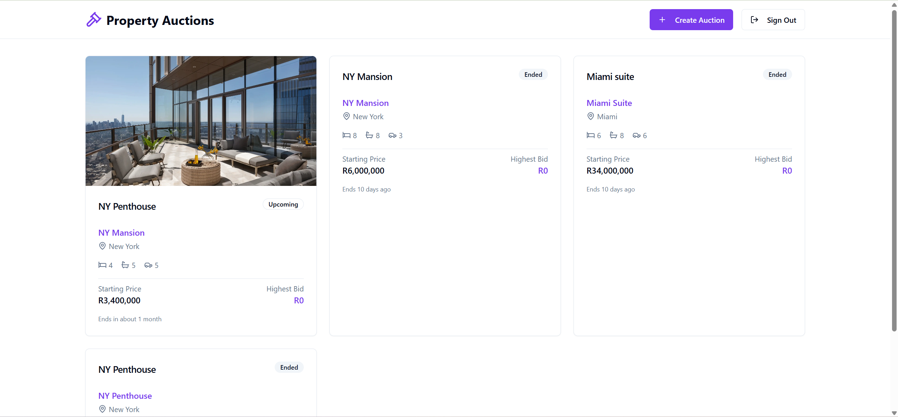
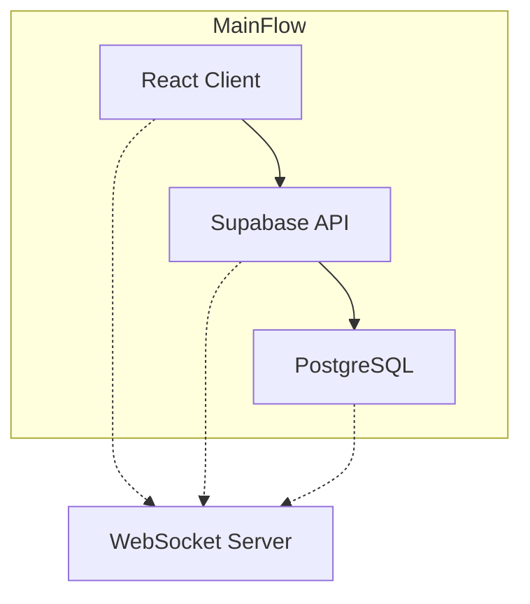

# Property Auction Platform

## Table of Contents
- [Overview](#overview)
- [Features](#features)
- [Technology Stack](#technology-stack)
- [Architecture](#architecture)
- [Prerequisites](#prerequisites)
- [Installation](#installation)

## Overview

A comprehensive real-time property auction platform built with React, TypeScript, and Supabase. This application enables users to create, participate in, and manage property auctions with real-time bidding capabilities. The platform features secure authentication, image management, and a modern responsive interface.

The system supports both traditional REST API interactions and WebSocket connections for real-time auction updates, making it suitable for high-stakes property auctions where timing is crucial.

## Features

### 🏠 Property Management
- **Comprehensive Property Listings**: Create detailed property listings with multiple images, descriptions, and specifications
- **Property Details**: Bedrooms, bathrooms, parking spaces, amenities, and location information
- **Image Management**: Upload multiple property images with preview and removal capabilities
- **Image Storage**: Secure cloud storage with Supabase Storage integration

### 🎯 Auction System
- **Real-time Auctions**: Live bidding with instant updates across all connected clients
- **Auction States**: Automatic state management (Upcoming, Active, Ended, Cancelled)
- **Bidding History**: Complete bid tracking with timestamps and bidder information
- **Auction Scheduling**: Set start and end dates with automatic state transitions

### 💰 Bidding Features
- **Real-time Bidding**: Instant bid updates using WebSocket connections
- **Bid Validation**: Automatic validation ensuring bids exceed current highest bid
- **Bid History**: View all bids with bidder details and timestamps
- **Highest Bid Tracking**: Automatic updates of highest bid amounts

### 🔐 Authentication & Security
- **Supabase Authentication**: Secure user registration and login
- **Row Level Security (RLS)**: Database-level security policies
- **Protected Routes**: Client-side route protection with authentication guards
- **Session Management**: Persistent login sessions with automatic token refresh

### 📱 User Interface
- **Responsive Design**: Mobile-first design that works on all devices
- **Modern UI Components**: Built with shadcn/ui for consistent design
- **Real-time Updates**: Live notifications and bid updates
- **Image Galleries**: Interactive image carousels for property viewing
- **Dark/Light Mode**: Theme support with system preference detection

### 🔔 Real-time Notifications
- **Bid Notifications**: Instant notifications when bids are placed
- **Auction Updates**: Real-time auction state changes
- **Toast Notifications**: User-friendly success and error messages

## Technology Stack

### Frontend
- **React 18** - Modern React with hooks and concurrent features
- **TypeScript** - Type-safe JavaScript development
- **Vite** - Fast build tool and development server
- **TanStack Query** - Powerful data fetching and caching
- **React Router v6** - Client-side routing with modern API
- **shadcn/ui** - High-quality UI components built on Radix UI
- **Tailwind CSS** - Utility-first CSS framework
- **Lucide React** - Beautiful icon library

### Backend & Database
- **Supabase** - Backend-as-a-Service with PostgreSQL
- **PostgreSQL** - Robust relational database
- **Supabase Auth** - Built-in authentication system
- **Supabase Storage** - File storage for images
- **Row Level Security** - Database-level security policies

### Real-time Communication
- **WebSocket Server** - Custom Node.js WebSocket implementation
- **Real-time Subscriptions** - Live data updates
- **Event-driven Architecture** - Efficient real-time communication

### Development Tools
- **ESLint** - Code linting and formatting
- **TypeScript Compiler** - Type checking and compilation
- **Vite Dev Server** - Hot module replacement for development

## Architecture

### System Architecture



### Database Schema
- **profiles** - User profile information extending Supabase auth
- **auctions** - Property auction details and metadata
- **bids** - Bid history and tracking
- **Storage** - Image files with public access policies

### Real-time Flow
1. Client connects to WebSocket server
2. User authentication via Supabase
3. Real-time bid updates broadcasted to all connected clients
4. Database updates trigger automatic highest bid calculations

## Prerequisites

Before running this application, ensure you have:

### Required Software
- **Node.js** (version 18 or higher) - [Download here](https://nodejs.org/)
- **npm** or **yarn** package manager
- **Git** - For version control

### Required Services
- **Supabase Account** - [Sign up at supabase.com](https://supabase.com)
- **Supabase Project** - Create a new project in your Supabase dashboard

## Installation

### 1. Clone the Repository
```bash
git clone https://github.com/yourusername/property-auction-platform.git
cd property-auction-platform
```

### 2. Install Dependencies
```bash
npm install
```

### 3. Start the Development Server
```bash
npm run dev
```

The application will be available at `http://localhost:8080`

## Performance Considerations

### Frontend Optimization
- **Code Splitting**: Automatic route-based code splitting with Vite
- **Image Optimization**: Lazy loading and responsive images
- **Caching**: TanStack Query provides intelligent caching
- **Bundle Size**: Tree-shaking and modern build optimization

### Database Optimization
- **Indexing**: Proper indexes on frequently queried columns
- **Query Optimization**: Efficient queries with proper joins
- **Connection Pooling**: Supabase handles connection management
- **Real-time Subscriptions**: Optimized for high-frequency updates

### Real-time Performance
- **WebSocket Efficiency**: Single connection per client
- **Message Broadcasting**: Efficient distribution to connected clients
- **State Management**: Optimized auction state tracking

## Security Features

### Authentication Security
- **JWT Tokens**: Secure token-based authentication
- **Row Level Security**: Database-level access control
- **Password Hashing**: Secure password storage with Supabase Auth
- **Email Verification**: Required email confirmation

### Data Security
- **Input Validation**: Client and server-side validation
- **SQL Injection Protection**: Parameterized queries
- **XSS Protection**: Sanitized user inputs
- **CORS Configuration**: Proper cross-origin request handling

### File Upload Security
- **File Type Validation**: Restricted to image files only
- **File Size Limits**: Configurable upload size limits
- **Secure Storage**: Supabase Storage with access policies

## Troubleshooting

### Common Issues

#### Build Errors
```bash
# Clear cache and reinstall
rm -rf node_modules package-lock.json
npm install

# Check TypeScript errors
npx tsc --noEmit
```

#### WebSocket Connection Issues
```bash
# Check if WebSocket server is running
netstat -an | grep :3001

# Test WebSocket connection
wscat -c ws://localhost:3001
```

#### Image Upload Issues
- Verify Supabase Storage bucket exists
- Check storage policies in Supabase dashboard
- Ensure file size limits are appropriate

### Debug Mode
Enable debug logging by setting:
```env
VITE_DEBUG=true
```

## Acknowledgments

- **Supabase** - For providing an excellent backend-as-a-service platform
- **shadcn/ui** - For beautiful and accessible UI components
- **TanStack Query** - For powerful data fetching and caching
- **Tailwind CSS** - For utility-first styling
- **React Community** - For continuous innovation and support
